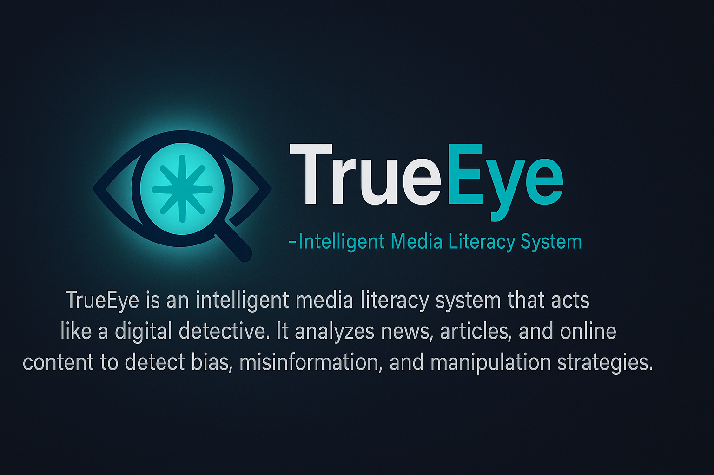

# TrueEye · Intelligent Media Literacy System 🚦🕵️‍♂️

*Powered 100 % by **Claude 3 Opus** (Anthropic API) 🔥*

<div align="center">
  
</div>

TrueEye turns any news article or post into a **professional report** covering 🔍

1. **Bias, tone & summary**
2. **Audience segmentation** (psychographics + demographics)
3. **Intent & risk** — hidden agendas, manipulation architecture & danger level

---

## ✨ Why Claude 3 Opus?

After a year of daily experimentation with the major LLMs, **Claude’s Constitutional AI training** still shows the best sensitivity to animosity and harmful rhetoric. That ethical backbone is the bedrock of TrueEye’s reliability.

---

## ⚡ Quick Start

```bash
git clone https://github.com/<user>/trueeye.git
cd trueeye
pip install -r requirements.txt
export ANTHROPIC_API_KEY="sk-..."   # your real key
python app.py                       # http://127.0.0.1:7860
```

> Runs on plain CPU; heavy lifting happens on Anthropic’s servers.

---

## 🛣️ Road-map

| Stage                | Status | Next steps                             |
| -------------------- | ------ | -------------------------------------- |
| **MVP**              | ✅      | Bias · Segmentation · Intent           |
| **Fact-checking**    | ⏳      | Integrate Serper / Tavily search tools |
| **Batch API**        | ⏳      | FastAPI `POST /analyze` (CSV / JSON)   |
| **Embeddings cache** | ⏳      | FAISS + LlamaIndex for repeat URLs     |
| **Multimodal**       | ⏳      | OCR + CLIP for memes & infographics    |

*(Wild ideas live in `docs/brainstorm.md`; see Issues/Projects for the active board.)*

---

## 🛡️ Ethical Principles (my own decalogue)

1. **Practical transparency** – explain what each module does, minus hype.
2. **Traceable rigor** – cite sources, version prompts, log decisions.
3. **No mind-dumping** – hide chain-of-thought to avoid mis-use.
4. **Protect the vulnerable** – raise the flag if content targets minors, elders or people in crisis.
5. **Correctness over comfort** – warn on uncertainty instead of bluffing.
6. **Responsible iteration** – manual review + stress tests for every new feature.
7. **Clean datasets** – never fine-tune on sensitive personal data or unlicensed material.
8. **Open code, open use** – MIT license; PRs are welcome but never forced.

---

## 🗂️ Repo Layout

```
trueeye/
├─ trueeye_flow.json   → LangFlow graph
├─ app.py              → Gradio UI
├─ requirements.txt
├─ .assets/            → logos, demo GIF
└─ docs/               → specs, notes, roadmap
```

---

## 🙏 Credits

| Project                       | Role                 |
| ----------------------------- | -------------------- |
| **Claude 3 Opus** – Anthropic | Reasoning engine     |
| **LangFlow**                  | Visual orchestration |
| **Gradio 4**                  | Lightweight web UI   |

---

**Author:** Gonzalo Romero — *DeepRat* 🐭🚀

> Exploring how Constitutional AI can level-up media literacy.
